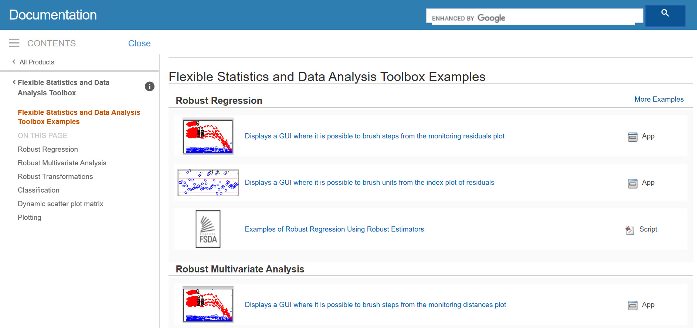

 

[?branchName=master)](https://dev.azure.com/aldocorbellini0395/FSDA/_build/latest?definitionId=2&branchName=master)

<!--

-->
# [Flexible Robust Statistics Data Analysis](https://github.com/UniprJRC/FSDA/)

## NEWS: new features (June 2023)
1. Now FSDA supports the new [buildtool](https://github.com/UniprJRC/FSDA/tree/master/utilities_help/build) feature (follow the link for more info) to create new releases on GitHub automatically leveraging
the sinergy of the new buildtool functionalities, (see an overview in the [documentation](https://it.mathworks.com/help/matlab/matlab_prog/overview-of-matlab-build-tool.html), available since R2022b)  MATLAB scripts and GitHub Actions.
Releasing a new FSDA release was a manual, multi-step process, that involved a lot of tasks in different environments, now the process runs entirely on GitHub and is consistent and fast.
(Our thanks goes to Jos Martin, Rob Purser, Bensingh Pancras and Andy Campbell that supported us with the implementation of this new feature)

2. Now FSDA is also availble as a [Docker](https://github.com/UniprJRC/FSDA/docker) (follow the link for more info) so if you need to run simulations on a HPC facility on Singularity/Apptainer or you just want to try FSDA with all the features you can follow this link and download a full fledged FSDA docker (yes it works also locally on WSL/WSL2!). 
Once a new release is created, a docker of FSDA is automatically build and can be easily pulled.
(Our thanks go to Jos Martin that helped us a lot on this project).

## FSDA

This project hosts the source code to the [original MATLAB FileExchange project](https://www.mathworks.com/matlabcentral/fileexchange/72999-fsda) and is place of active development.

FSDA Toolbox™ provides statisticians, engineers, scientists, researchers, financial analysts with a comprehensive set of tools to assess and understand their data. Flexible Statistics Data Analysis Toolbox™ software includes functions and interactive tools for analyzing and modeling data, learning and teaching statistics.

The Flexible Statistics Data Analysis Toolbox™ supports a set of routines to develop robust and efficient analysis of complex data sets (multivariate, regression, clustering, ...), ensuring an output unaffected by anomalies or deviations from model assumptions. 

In addition, it offers a rich set interactive graphical tools which enable us to explore the connection in the various features of the different forward plots.

All Flexible Statistics Data Analysis Toolbox™ functions are written in the open MATLAB® language. This means that you can inspect the algorithms, modify the source code, and create your own custom functions.

 For the details about the functions present in FSDA you can browse the categorial and alphabetical list of functions of the toolbox inside MATLAB (once FSDA is installed) or at the web addresses 
 [http://rosa.unipr.it/FSDA/function-cate.html](http://rosa.unipr.it/FSDA/function-cate.html) and [http://rosa.unipr.it/FSDA/function-alpha.html](http://rosa.unipr.it/FSDA/function-alpha.html)

#### FSDA

* Is especially useful in detecting in data potential anomalies (outliers), even when they occur in groups.
Can be used to identify sub-groups in heterogeneous data.
* Extends functionalities in key statistical domains requiring robust analysis (cluster analysis, discriminant analysis, model selection, data transformation).
* Integrates instruments for interactive data visualization and modern exploratory data analysis, designed to simplify the interpretation of the statistical results by the end user.
* Provides statisticians, engineers, scientists, financial analysts a comprehensive set of tools to assess and understand their data.
* Provides practitioners, students and teachers with functions and graphical tools for modeling complex data, learning and teaching statistics.

FSDA is developed for wide applicability. For its capacity to address problems focusing on anomalies in the data, it is expected that it will be used in applications such as anti-fraud, detection of computer network intrusions, e-commerce and credit cards frauds, customer and market segmentation, detection of spurious signals in data acquisition systems, in chemometrics (a wide field covering biochemistry, medicine, biology and chemical engineering), in issues related to the production of official statistics (e.g. imputation and data quality checks), and so on.

For more information see the Wiki page at [https://github.com/UniprJRC/FSDA/wiki](https://github.com/UniprJRC/FSDA/wiki)

#### Ways to familiarize with the FSDA toolbox 

* Run the examples contained in files examples_regression.m or examples_multivariate.m or examples_categorical.m.  Notice that all examples are organized in cells
* Run the GUIs in the FSDA Matlab help pages. 
  For a preview see [http://rosa.unipr.it/FSDA/examples.html](http://rosa.unipr.it/FSDA/examples.html)

  

* Watch the videos in the Examples section of the FSDA Matlab help pages 
For a preview see [http://rosa.unipr.it/fsda_video.html](http://rosa.unipr.it/fsda_video.html)

* Read section "Introduction to robust statistics" or "Technical introduction to Robust Statistics" in the FSDA Matlab help pages. For a preview see [http://rosa.unipr.it/FSDA/tutorials.html](http://rosa.unipr.it/FSDA/tutorials.html)

  

   
